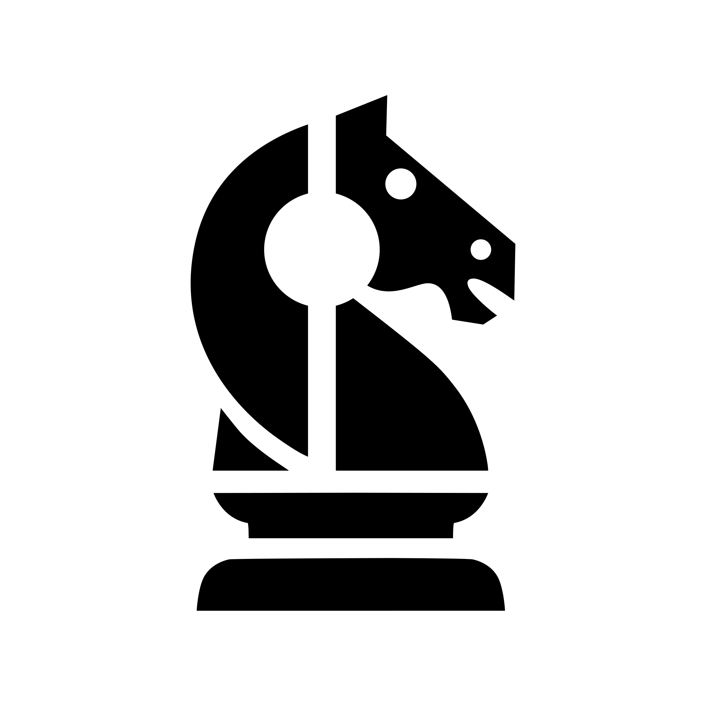
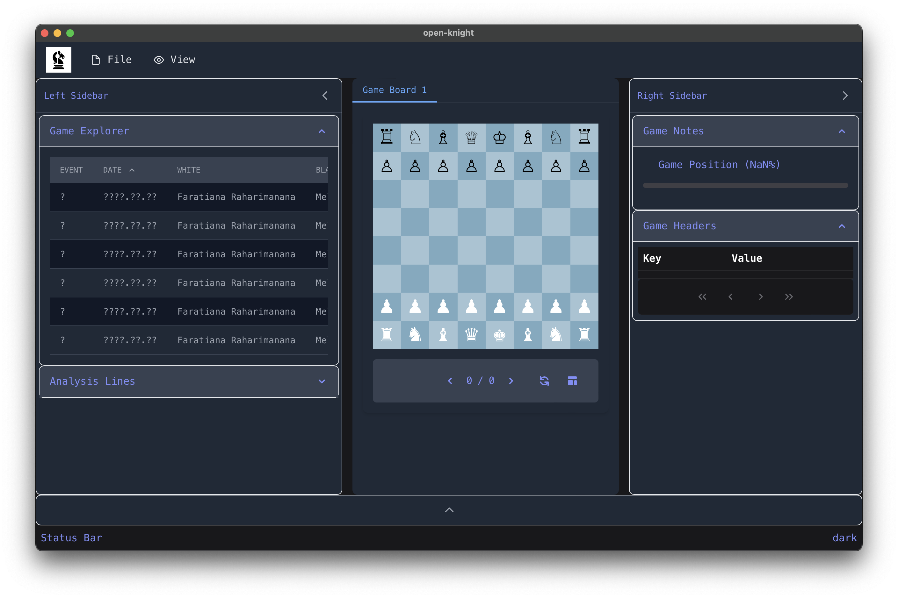

<div align="center">

  
  <h1>Open Knight</h1>
  
  <p>
    A cross-platform chess database and analysis application.
  </p>
  
<!-- Badges -->
<p>
  <a href="https://github.com/reidpritchard/open-knight/graphs/contributors">
    
  </a>
  <a href="">
    
  </a>
  <a href="https://github.com/reidpritchard/open-knight/network/members">
    
  </a>
  <a href="https://github.com/reidpritchard/open-knight/stargazers">
    
  </a>
  <a href="https://github.com/reidpritchard/open-knight/issues/">
    
  </a>
  <a href="https://github.com/reidpritchard/open-knight/blob/main/docs/LICENSE">
    
  </a>
</p>

<h4>
    <a href="https://github.com/reidpritchard/open-knight">Documentation</a>
  <span> · </span>
    <a href="https://github.com/reidpritchard/open-knight/issues/">Report Bug</a>
  <span> · </span>
    <a href="https://github.com/reidpritchard/open-knight/issues/">Request Feature</a>
  </h4>
</div>

<br />

<!-- Table of Contents -->
# Table of Contents

<!-- @import "[TOC]" {cmd="toc" depthFrom=1 depthTo=6 orderedList=false} -->

<!-- code_chunk_output -->

- [Table of Contents](#table-of-contents)
  - [About the Project](#about-the-project)
    - [Screenshots](#screenshots)
    - [Tech Stack](#tech-stack)
    - [Features (more in development)](#features-more-in-development)
    - [Color Reference](#color-reference)
    - [Environment Variables](#environment-variables)
  - [Getting Started](#getting-started)
    - [Prerequisites](#prerequisites)
    - [Run the project locally](#run-the-project-locally)
  - [Usage](#usage)
  - [Roadmap](#roadmap)
  - [Contributing](#contributing)
    - [Code of Conduct](#code-of-conduct)
  - [FAQ](#faq)
  - [License](#license)
  - [Contact](#contact)
  - [Acknowledgements](#acknowledgements)

<!-- /code_chunk_output -->

<!-- About the Project -->
## About the Project

<!-- Screenshots -->
### Screenshots

<div align="center">
  
</div>

<!-- TechStack -->
### Tech Stack

<details>
  <summary>Client</summary>
  <ul>
    <li><a href="https://www.typescriptlang.org/">Typescript</a></li>
    <li><a href="https://vuejs.org/">Vue.js</a></li>
    <li><a href="https://tailwindcss.com/">TailwindCSS</a></li>
    <li><a href="https://primevue.org/">PrimeVue Components</a></li>
  </ul>
</details>

<details>
  <summary>"Backend" (Tauri)</summary>
  <ul>
    <li><a href="https://www.rust-lang.org/">Rust</a></li>
    <li><a href="https://diesel.rs/">Diesel</a></li>
  </ul>
</details>

<details>
<summary>Database</summary>
  <ul>
    <li><a href="https://www.sqlite.org/">SQLite</a></li>
  </ul>
</details>

<details>
<summary>DevOps</summary>
  <ul>
    <li> TODO </li>
  </ul>
</details>

<!-- Features -->
### Features (more in development)

- Import PGN files
- Chess game viewer
- Game/Move annotations
- Move tree/list
- Theme support

<!-- Color Reference -->
### Color Reference

The default theme is based on the [Aura theme](https://primevue.org/theme/aura/) for PrimeVue. It supports light and dark modes. It's setup to facilitate additional custom themes in the future, so these colors aren't final.

| Color             | Hex                                                                |
| ----------------- | ------------------------------------------------------------------ |
| Primary Color |  #222831 |
| Secondary Color |  #393E46 |
| Accent Color |  #00ADB5 |
| Text Color |  #EEEEEE |

<!-- Env Variables -->
### Environment Variables

Currently no environment variables are needed. You can modify the default database location in the `src-tauri/.env` file.

<!-- Getting Started -->
## Getting Started

<!-- Prerequisites -->
### Prerequisites

This project uses `npm` as package manager.

Tauri uses `rust` and `cargo` to build the application. Instructions for installing `rust` can be found [here](https://www.rust-lang.org/tools/install).

<!-- Installation -->
### Run the project locally

Clone the project

```bash
git clone https://github.com/reidpritchard/open-knight.git
```

Go to the project directory

```bash
  cd open-knight
```

Install dependencies

```bash
  npm install
```

Run database migrations

```bash
  npm run db:migrate
```

Run the whole project in development mode

```bash
  npm run tauri dev
```

Run only the frontend

```bash
  npm run dev
```

<!-- Usage -->
## Usage

The project is under active development and new features are being added frequently. Currently it's not recommended to use the application in a production environment.

<!-- Roadmap (in no particular order) -->
## Roadmap

Listed in no particular order and likely to change:

- [x] PGN Parsing
- [x] Import PGN files
- [x] Chess game viewer
- [x] Basic UI layout customization
- [x] Game/Move annotations
- [x] Move tree/list
- [x] Theme support
- [ ] UCI support
- [ ] Drag and drop imports
- [ ] PGN export
- [ ] Position search
- [ ] Tactics/Motif search
- [ ] Openings support

<!-- Contributing -->
## Contributing

Contributions are always welcome!

See `contributing.md` for ways to get started.

<!-- Code of Conduct -->
### Code of Conduct

Please read the [Code of Conduct](https://github.com/reidpritchard/open-knight/blob/main/docs/CODE_OF_CONDUCT.md)

<!-- FAQ -->
## FAQ

- Does this project support X feature?

  - Likely not. It's still in early alpha, but you can always open an issue or submit a PR!

- How can I help?

  - Any contributions are welcome! See the [Contributing](https://github.com/reidpritchard/open-knight/blob/main/CONTRIBUTING.md) section for more information.

<!-- License -->
## License

The project uses the [PolyForm Noncommercial 1.0.0 License](https://github.com/reidpritchard/open-knight/blob/main/docs/LICENSE.md). See the license file for more information.

<details>
<summary>Reason for license</summary>
I chose this license because I want to keep the project open source, but also want to ensure that it's not used in a way that is harmful to the development of the project. For example, I don't want a company making a profit off of the project without contributing back. I am open to more traditional OSI approved licenses in the future, but for now this one allows me to keep more control over the project. I'd rather move from this license to something more permissive in the future rather than the other way around.
</details>

<!-- Contact -->
## Contact

Reid Pritchard - [@reidpritchard](https://github.com/reidpritchard) - <reidprichard99@gmail.com>

Project Link: [https://github.com/reidpritchard/open-knight](https://github.com/reidpritchard/open-knight)

<!-- Acknowledgments -->
## Acknowledgements

- [Shields.io](https://shields.io/)
- [Awesome README](https://github.com/matiassingers/awesome-readme)
- [Readme Template](https://github.com/othneildrew/Best-README-Template)
- [Tauri](https://github.com/tauri-apps/tauri)
